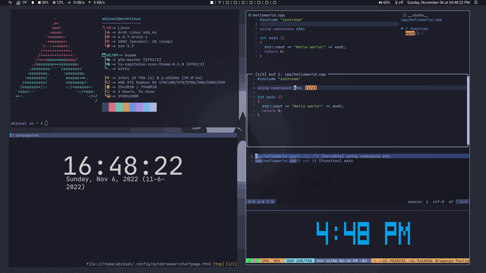

<h2 align="center"> Tokyo Night and Dracula
</h2>

<!-- BADGES -->
<div align="center">
   <p></p>
   <a href="https://github.com/abissaldev/dotfiles/stargazers">
      
   </a>
   <a href="https://github.com/abissaldev/dotfiles/issues">
      
   </a>
   <a href="./LICENSE">
      
   </a>
   <br>
</div>
<p/>
<h2></h2>

<!-- INFORMATION -->
## :herb: <samp>INFORMATION</samp> 

   

   Thanks for dropping by! This is my personal repository of my dotfiles.

   The [setup section](#-setup) will guide you through a step-by-step installation process.

   Here are more information about my setup:

   - **Window Manager:** [bspwm](https://github.com/baskerville/bspwm)
   - **Terminal:** [kitty](https://github.com/kitty/kitty)
   - **Shell:** [zsh](https://www.zsh.org/)
   - **Panel:** [polybar](https://github.com/polybar/polybar)
   - **Compositor:** [picom](https://github.com/yshui/picom)
   - **Editor:** [neovim](https://github.com/neovim/neovim)
   - **Browser:** [qutebrowser](https://github.com/qutebrowser/qutebrowser)
   - **Notification Daemon:** [dunst](https://github.com/dunst-project/dunst)
   - **File Manager:** [thunar](https://github.com/xfce-mirror/thunar)
   - **Application Launcher:** [rofi](https://github.com/davatorium/rofi)
   
   <!-- SETUP -->
   ## :wrench: <samp>SETUP</samp>
   
   This is step-by-step how to install these dotfiles. Just [R.T.F.M](https://en.wikipedia.org/wiki/RTFM).
   
   Clone Repository

   ```sh
    git clone https://github.com/abissaldev/dotfiles.git
    cd dotfiles
   ```
   ## 📦 Installation
   
   <strong>Arch Linux (and other Arch-based distributions)</strong>

   > Assuming your **AUR Helper** is [yay](https://github.com/Jguer/yay).
   ```sh
    yay -S bspwm sxhkd rofi polybar qutebrowser neovim-git kitty viewnior picom \
      hsetroot maim xclip imagemagick setxkbmap thunar dunst Pavucontrol \
      feh ctags zsh
   ```
  
   <summary><strong>Fonts</strong></summary>

   > **NOTE**: Only important fonts has been listed on the table above.

   ```sh
    $ cp -r ./fonts/* $HOME/.local/share/fonts
   ```
   

<strong>Configuration Files and Binaries</strong>

   - `rsync` method <kbd>**RECOMMENDED**</kbd>

      ```sh
       mkdir -p $HOME/.config/ && rsync -avxHAXP config/ $HOME/.config
       mkdir -p $HOME/.icons/bin/ && rsync -avxHAXP bin/ $HOME/.local/bin/
       rsync -avxHAXP HOME/ $HOME/
       rsync -avxHAXP wallpapers/ $HOME/Pictures
      ```

      > **WARNING**: Ensure the `rsync` command must be correct as above.
      > 
      > |   Options   |                      Function                         |
      > | ----------- | ----------------------------------------------------- |
      > | `-a`        | Archive mode                                          |
      > | `-v`        | Verbose mode                                          |
      > | `-x`        | Don't cross filesystem boundaries                     |
      > | `-H`        | Preserve hard links                                   |
      > | `-A`        | Preserve ACLs/permissions                             |
      > | `-X`        | Preserve extended attributes                          |
      > | `-P`        | Show progress during transfer                         |
      > | `--exclude` | Exclude files matching `PATTERN`                      |
   - `cp` method

      ```sh
       mkdir -p $HOME/.config/ && cp -r ./config/* $HOME/.config/
       mkdir -p $HOME/.local/bin/ && cp -r ./bin/* $HOME/.local/bin/
       cp -r ./HOME/* $HOME/
       cp -r ./wallpapers/* $HOME/Pictures
      ```

   > **DIFFERENCES**  
   > - `cp` is for duplicating stuff and by default only ensures files have unique full path names.
   > - `rsync` is for synchronizing stuff and uses size and timestamp of files to decide if they should be replaced.
   > I also recommend to not delete the **dotfiles** directory after cloning to make upgrades easier.

### <samp><kbd>III.</kbd> INSTALLATION (FINALIZING)<samp>

   Once finished copying the files, you might want to finalize the changes to your system.

   <details>
   <summary><strong>Regenerating font cache</strong></summary>

   > This ensures all existing caches are cleared and regenerated for all installed fonts.
   ```sh
    $ fc-cache -v
   ```
   </details>

   <details>
   <summary><strong>Finalizing installation</strong></summary>

   > Lastly, log out from your current desktop session and log in into bspwm.
   > If you're using [`~/.xinitrc`](https://wiki.archlinux.org/title/Xinit), simply add the following line at the end.
   ```sh
    exec bspwm
   ```
